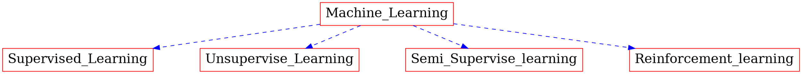

# Foundation of Machine Learning :memo:

This `repo` is created for understanding the basic concenpts in `Machine-Learning`. The topics covered in this `repo` goes in hand with [CS725](https://www.cse.iitb.ac.in/~sunita/cs725/) course in [Computer science](https://www.cse.iitb.ac.in/) Department of [IIT Bombay](http://iitb.ac.in/).

## What is Machine Learning ?
In simple words Machine means a program which learns.
Machine Learning is a technique of training machines to perform the activities a human brain can do, albeit bit faster and better than an average human-being.

#### Machine learning (Tree structure for understanding)

So lets get started :rocket: 

# Supervised learning
Supervised learning is when the model is getting trained on a labelled dataset. Labelled dataset is one which have both input and output parameters. In this type of learning both training and validation datasets are labelled.